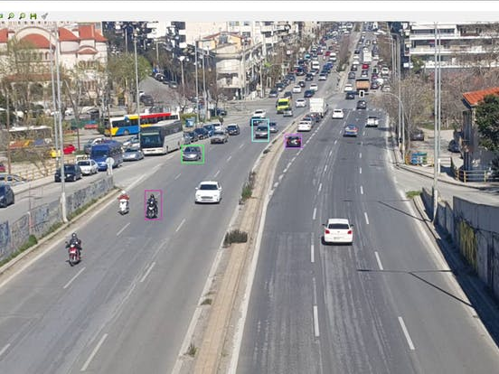

# Object_tracking

Here I showed how to do Computer Vision Object Tracking from Videos. The main goal of this project is to show how Optical and Dense Optical Flow work, how to use MeanShift and CamShist and how to do a Single and a Multi-Object Tracking. I used opencv and python for this project. Some demos from the output cell is here    
    

